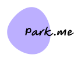

# park.me

<p align="center">
  
</p>

*park.me* is a modern, user-friendly and instant solution for customers to reserve long-term, or short-term parking spaces for their needs in any airport around the world.

## Get Started
Get the project up and running with npm
```bash
npx parkme
```


## Built Using


## Contributors
<a href="https://github.com/it24102532/parkingManagement/graphs/contributors">
  
</a>

Made with [contrib.rocks](https://contrib.rocks).
